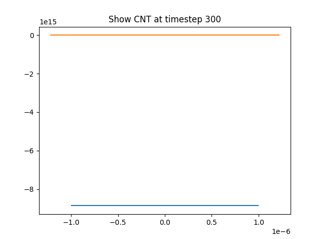
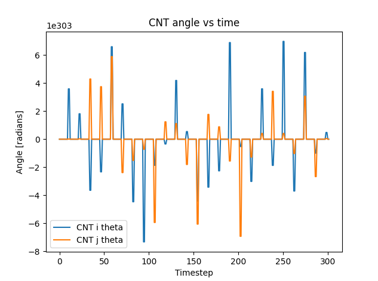
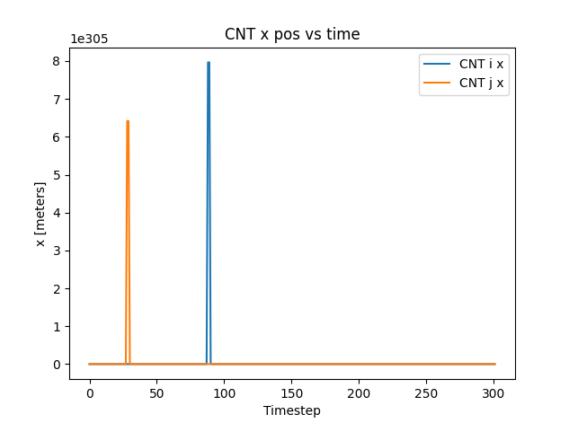
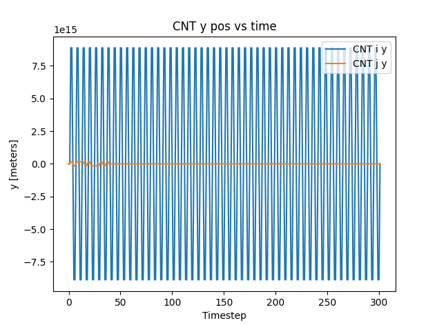
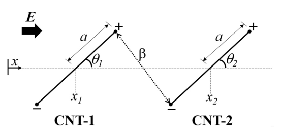
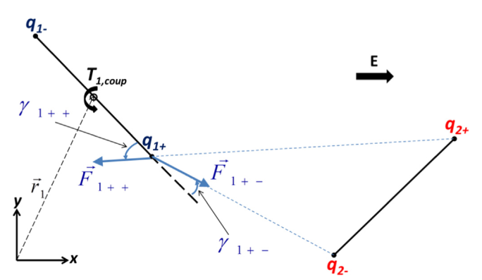

# ME118 Project   
   
# Paper   
[Resin\_CNT\_Align\_Paper-1.pdf](files/resin_cnt_align_paper-1.pdf)    
   
# Simulation Results   
with dynamic visc init 25   
```
At timestep 0 CNT i theta: [3.14159265] CNT j theta: [3.14159265]
At timestep 3 CNT i theta: [-7.75356643e+22] CNT j theta: [-7.75356643e+22]
At timestep 30 CNT i theta: [-6.19300055e+22] CNT j theta: [-6.19300055e+22]
At timestep 300 CNT i theta: [-2.66876527e+23] CNT j theta: [-2.66876527e+23]
At timestep 3000 CNT i theta: [-4.35410152e+24] CNT j theta: [-4.35410152e+24]
At timestep 30000 CNT i theta: [-9.33663857e+54] CNT j theta: [5.74264433e+54]
```
   
```
At timestep 0 CNT i theta: [3.14159265] CNT j theta: [3.14159265]
At timestep 3 CNT i theta: [-7.75356643e+22] CNT j theta: [-7.75356643e+22]
At timestep 30 CNT i theta: [-6.19300055e+22] CNT j theta: [-6.19300055e+22]
At timestep 300 CNT i theta: [-2.66876527e+23] CNT j theta: [-2.66876527e+23]
At timestep 3000 CNT i theta: [-4.35410152e+24] CNT j theta: [-4.35410152e+24]
At timestep 30000 CNT i theta: [-9.33663857e+54] CNT j theta: [5.74264433e+54]
```
   
```
At timestep 0 CNT i theta: [3.14159265] CNT j theta: [3.14159265]
At timestep 3 CNT i theta: [-35332417.84059966] CNT j theta: [-35332417.84059966]
At timestep 30 CNT i theta: [-4.52506955e+10] CNT j theta: [-4.52506955e+10]
At timestep 300 CNT i theta: [-7.95177836e+11] CNT j theta: [-7.95177836e+11]
At timestep 3000 CNT i theta: [1.64941533e+12] CNT j theta: [1.64941533e+12]
At timestep 30000 CNT i theta: [3.08086762e+12] CNT j theta: [3.08086762e+12]
```
   
For two CNTs starting at pi over 6 and pi over 2, 300 timesteps at 10 timesteps a second, constant viscosity   
    
    
    
    
   
# Simulation Equations   
 --- 
## CNT Alignment in Electric Field   
Solid CNTs are dispersed in a CV of resin at a given density rate:   
```
cnt_density: number greater than 0; # of cnts per um^3
cnt_density_normalized: number from 0 to 1
```
An electric field is defined within the resin volume → CNTs will undergo rotational and transnational motion and the following diagram can be created for 2 CNTs:   
    
The governing rotational motion equation for a CNT is given by:   

$$
I\frac{d^2\theta}{dt^2} +T_{DEP} + T_{fr} + T_{coup} =0
$$
This equation covers three mechanisms for rotational motion: DEP torque, viscous friction, and Coulombic interactions, where:   

$$
I = m(a^2 + b^2)/5 \\
m = d_{cnt}V \\
V=\frac{4}{3}\pi ab^2
$$
T-DEP is the DEP torque and and is exerted on the CNT due to the electric field. It is given by:   

$$
T_{DEP} =\frac{1}{4}V\epsilon_mE^2Re[\alpha^*]sin(2\theta)
$$
where E is the magnitude if the electric field, V is the volume of the CNT, and   

$$
\alpha^* =\frac{(\epsilon^{*}_{eq}-\epsilon^{*}_{m})^2}{(\epsilon^{*}_{m}+(\epsilon^{*}_{eq}-\epsilon^{*}_{m})L)(\epsilon^{*}_{eq}+\epsilon^{*}_{m})}
$$
Where epsilon is the permittivity and L is the CNT longitudinal polarization factor which is given by:   

$$
L =\frac{ln(2a/b)-1}{(a/b)^2}
$$
The subscripts "CNT", "m", and "lay" stand for the carbon nanotube, the surrounding medium, and the interphase layer. We can continue to define:   

$$
\epsilon^{*}_{eq} =\epsilon^{*}_{lay}\left(\frac{\epsilon^{*}_{CNT}+\frac{\delta}{2a}(\epsilon^{*}_{CNT}-\epsilon^{*}_{lay})}{\epsilon^{*}_{lay}+\frac{\delta}{2a}(\epsilon^{*}_{CNT}-\epsilon^{*}_{lay})}\right)
$$
and    

$$
\epsilon^* =\epsilon - j\frac{\sigma}{2\pi f}
$$
Where sigma is the electrical conductivity and f is the frequency of the electrical field, epsilon-dnt is of the cnt, epsilon-m is of the fluid, and epsilon-lay is of the interphase layer. Note that the torque of the DEP depends on the real part of alpha star.   
   
The torque due to viscous friction is given by   

$$
T_{fr} =8\pi\eta r_e^3 K_r\frac{d\theta}{dt}
$$
Where eta is the viscosity of the fluid and r-e is the equivalent radius of a sphere of volume equal to that of the CNT and is given by   

$$
r_e =a^{1/3}b^{2/3}
$$
The constant K-r is given by:   

$$
K_r =\frac{4p^2(1-p^2)}{3\left(\frac{2p^{2/3}(2-p^{-2})}{K_t} - 2\right)}
$$
Where   

$$
p = a/b
$$
and    

$$
K_t = \frac{\sqrt{1-p^{-2}}}{p^{-2/3}ln[p(1+\sqrt{1-p^{-2}})]}
$$
K-r and K-t are respectively, the rotational and translational friction coefficients for prollate ellipsoids.   
   
The magnitude of the Coulombic force exerted by a positive charged CNT due to a negative charge CNT is given by:   

$$
F_{1+-} = \frac{1}{4\pi\epsilon_m}\frac{|q^*_{1+}||q^*_{2-}|}{|r_1^+-r_2^-|^2}
$$
Where r-1 and r-2 are the vector distances to the CNT. We can use the same logic to define F-1++, F-1-+, and F-1- -. The charge induced at the tips of the CNTs is given by:   

$$
q_i^* = \frac{\epsilon_mV_iE}{2a_i}\frac{\epsilon^*_{eq,i}-\epsilon^*_{m}}{\epsilon^*_{ m}+(\epsilon^*_{eq,i}-\epsilon^*_{m})L_i}
$$
The torque T-1+- given by the force F-1+- and T-1++ given by the force F-1++   

$$
T_{1+-} = a_1F_{1+-}sin(\gamma_{1+-}) \\
T_{1++} = a_1F_{1++}sin(\gamma_{1++})
$$
Where gamma-1++ and gamma-1+- are the angles between the forces and the direction of the CNT-1 longitudinal axis as seen below:   
    
And therefore, we can write that the torque is experienced by the CNT-i due to the presence of CNT-j is given by:   

$$
T_{i,coup} =a_i[F_{i,+-}sin(\gamma_{i,+-})+F_{i,++}sin(\gamma_{i,++})+F_{i,-+}sin(\gamma_{i,-+})+F_{i,--}sin(\gamma_{i,--})]
$$
   
The governing transnational motion equation for a CNT is given by:   

$$
m\frac{d^2x}{dt^2}+(F_{fr})_x + (F_{coup})_x + (F_{rep})_x = 0 \\
m\frac{d^2y}{dt^2}+ (F_{fr})_y + (F_{coup})_y + (F_{rep})_y = 0
$$
Where once again, F-fr is the viscous friction force, F-coup is the force due to Coulombic forces and F-rep is a short range repulsive force that prevents CNTs from overlapping.   
   
The viscous friction force is given by:   

$$
(F_{fr})_x = 6\pi\eta r_e K_t\frac{dx}{dt} \\
(F_{fr})_y = 6\pi\eta r_e K_t\frac{dy}{dt}
$$
Which is similar to the case of torque.    
   
The x and y components of the total Coulombic forces are given by:   

$$
(F_{i, coup})_x = (F_{i, +-})_x + (F_{i, ++})_x+(F_{i, -+})_x+(F_{i, --})_x \\
(F_{i, coup})_y = (F_{i, +-})_y + (F_{i, ++})_y+(F_{i, -+})_y+(F_{i, --})_y
$$
   
Finally, the repulsive force is given by:   

$$
F_{i, rep} = (F_{i, coup})\left( exp\left( -100\left( \frac{|r^-_2 - r^+_1|}{\Delta} - 1 \right) \right) + exp\left( -100\left( \frac{|r^+_2 - r^-_1|}{\Delta} - 1 \right) \right) \right)
$$
Where Delta is the cut off distance. (In the paper is considered as 1nm).    
   
### Literature:   
   
   
   
## Resin Curing   
Resin cures (degree of cure goes from 0 to 1) changing the viscosity  and temperature as a function of time. The viscosity is given by the Castro-Macosko Model as:   

$$
\eta = B exp\left(\frac{T_b}{T}\right)\left(\frac{\alpha_g}{\alpha_g - \alpha}\right)^{C_1+C_2\alpha}
$$
Where B is the reference viscotiy, T-b is a parameter dependent on the activation energy of the resin, E such that :   

$$
T_b = E/R
$$
Where R is the ideal gas constant and alpha g is the flow threshold. We can define alpha g as:   

$$
\alpha_g = [r(f-1)(g-1)]^{-1/2}
$$
Where r is the ratio between resin and hardener and f and g are the functionality of the resin and hardener respectively. Using the Reaction Kinetics (RK) model, we can get:   

$$
\frac{\partial \alpha}{\partial t} = Kf(\alpha)


$$
Where the nth order reaction is given by:   

$$
f(\alpha) = (1-\alpha) ^n
$$
the most popular RK model, given by Kamal and Sourour is:    

$$
\frac{\partial\alpha}{\partial t} = (k_1 + k_2\alpha^m)(1-\alpha)^n
$$
Where k-1 and k-2 are defined from the Arrhenius relationship as:   

$$
k_i = A_iexp\left(\frac{-E_i}{T}\right)
$$
For an Arrhenius relationship, we can define the viscosity as:   

$$
\mu = Ae^{\frac{\Delta E}{RT}f(x)}
$$
### Literature:   
Description of the Resin Curin…    
   